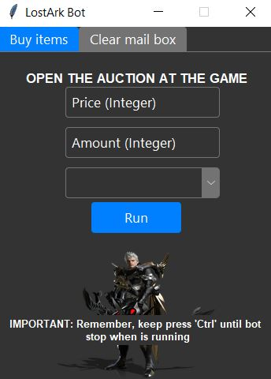
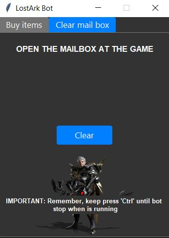

# LostArk-Bot

## Features
- [x] Buy items at desired price
- [x] Auto no-afk while is buying
- [x] Auto clear mailbox
- [x] App window on top of others apps 
- [x] Support all resolutions

Auto-buy items at the auction at desired price, buy low and sell high




Clear all mailbox and delete messages



## Getting started

```bash
py main.py
```

### Requirements
#### Keyboard
#### Pillow
#### PyAutoGUI

### Option 1 to install requirements
```bash
pip install -r
```

### Option 2 to install requirements
### Install keyboard
```bash
pip install keyboard
```

### Install Pillow
```bash
pip install pillow
```

### Install PyAutoGUI
```bash
pip install pyautogui
```

## How it works

### Buy items + noafk

Open the auction and search your desired product, fill the fields at the bot, select what clic you will use to mover at the game, then clic on 'Run'.
No-afk is automatic, so your character will walk every 5 minutes randomly.

### Clear mailbox

Open your mailbox, then clic on the bot the 'Clear' button, it will working indefinitely, keep press 'ctrl' to stop it when your mailbox is empty.


## KEEP PRESS 'CTRL' WHEN BOT IS RUNNING TO STOP IT